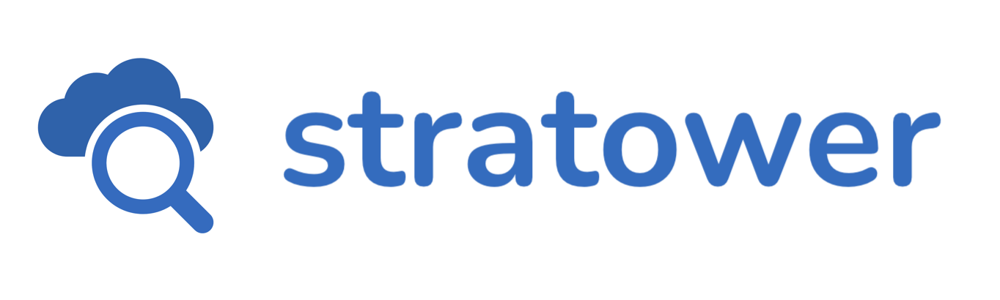
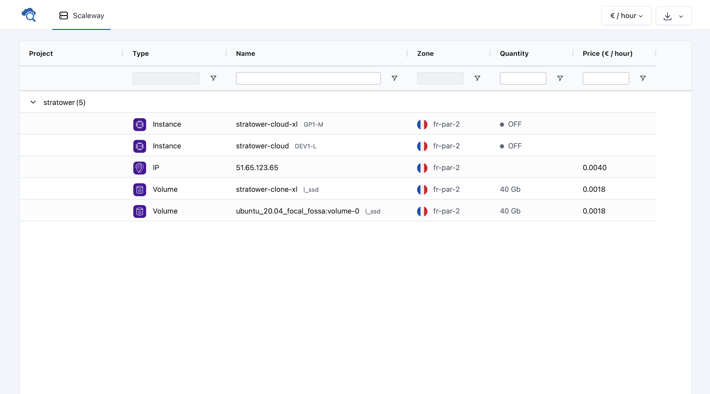

Stratower is an open-source lightweight dashboard to synthetize Cloud resources usage, in real-time.

**Supported Cloud Providers:**
* ✅ Scaleway

## Screenshots


## Security
To ensure API keys of Cloud providers are safe and never sent somewhere, Stratower is based on [Deno](http://deno.land/) with minimalist network permissions.  

For more information, see [`bin/stratower`](bin/stratower) file.

## Getting Started
### With Docker
```bash
docker run -d \
    --name stratower \
    -p 8080:8080 \
    -e STRATOWER_CLUSTERS=Scaleway \
    -e STRATOWER_Scaleway_PROVIDER=scaleway \
    -e STRATOWER_Scaleway_ORGANIZATION_ID=<org-id> \
    -e STRATOWER_Scaleway_AUTH_TOKEN=<auth-token> \
    stratower/stratower:latest
```

### From source
```bash
# Install Deno
curl -fsSL https://deno.land/x/install/install.sh | sh

# Copy configuration (fill the .env file)
cp .env.sample .env

# Start Stratower
bin/stratower
```

## Configuration
Stratower is configured entirely from **environment variables**. In case you prefer using a configuration file, you can also use the `.env` file.

### Example
```bash
PORT=8080
STRATOWER_CLUSTERS=foo

STRATOWER_foo_PROVIDER=scaleway
STRATOWER_foo_NAME=My Cluster
STRATOWER_foo_ICON=cloud-computing
STRATOWER_foo_ORGANIZATION_ID=b8fc2b01-b722-4823-947c-64dfb9c840c4
STRATOWER_foo_AUTH_TOKEN=b8fc2b01-b722-4823-947c-64dfb9c840c4
```

### Clusters
A **Cluster** is a tab view, associated to a cloud provider. Stratower can handle multiple clusters at a time, to aggregate multiple cloud providers data.

* `STRATOWER_CLUSTERS` _(**required**, coma-separated array)_  
List of clusters to register in Stratower

```bash
STRATOWER_CLUSTERS=foo
STRATOWER_CLUSTERS=one,two
```

For each cluster, define provider-specific environment variables. See configuration guides below.

### Clusters Configuration
Click on a Cloud provider to see the configuration guide :
* [Scaleway](docs/providers/scaleway.md)

## Contribute
Feel free to report issues or to contibute to this project!  
Learn how on the [Contributing page](docs/contributing.md).
